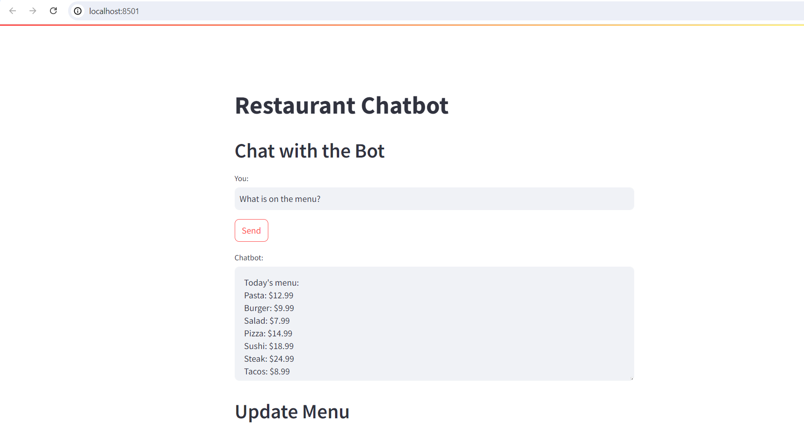

# Restaurant Chatbot

This is a Streamlit-based web application that provides a chatbot interface for a restaurant. The chatbot can provide information about the menu, restaurant timings, location, contact information, and daily specials. Users can also place orders through the chatbot.

## Features

- **Chat with the Bot:** Ask the chatbot about the menu, timings, location, contact information, specials, and place orders.
- **Update Menu:** Add or update menu items and their prices.
- **Update Restaurant Timings:** Set or update the restaurant's operating hours for each day of the week.
- **Update Restaurant Location:** Set or update the restaurant's location.
- **Update Contact Information:** Set or update the restaurant's contact details, including phone number, email, and website.
- **Update Daily Specials:** Set or update the special dishes for each day of the week.

## Screenshots

### Home Page


## Installation

1. **Clone the repository:**

    ```bash
    https://github.com/Jafar-97/Chatbot.git
    cd restaurant-chatbot
    ```

2. **Create a virtual environment:**

    ```bash
    python -m venv myenv
    source myenv/bin/activate   # On Windows use `myenv\Scripts\activate`
    ```

3. **Install the dependencies:**

    ```bash
    pip install -r requirements.txt
    ```

4. **Run the Streamlit app:**

    ```bash
    streamlit run app.py
    ```

## Usage

1. **Start the Streamlit application:**

    ```bash
    streamlit run app.py
    ```

2. **Open your web browser and navigate to:**

    ```
    http://localhost:8501
    ```

3. **Interact with the chatbot:**

    - **Chat with the Bot:** Type your question or message in the input box and press "Send".
    - **Update Menu:** Enter the menu item and its price, then press "Update Menu".
    - **Update Restaurant Timings:** Set the operating hours for each day and press "Update Timings".
    - **Update Restaurant Location:** Enter the location and press "Update Location".
    - **Update Contact Information:** Enter the phone number, email, and website, then press "Update Contact Info".
    - **Update Daily Specials:** Enter the specials for each day and press "Update Specials".
    - **Place an Order:** Enter the order details and press "Place Order".

## Menu Data

The menu data is stored in a JSON file (`menu.json`). The structure of the file is as follows:

```json
{
    "menu": {
        "Pizza": 10.99,
        "Burger": 8.99
    },
    "timings": {
        "Monday": "9 AM - 9 PM",
        "Tuesday": "9 AM - 9 PM"
    },
    "location": "123 Food St.",
    "contact": {
        "phone": "123-456-7890",
        "email": "info@restaurant.com",
        "website": "www.restaurant.com"
    },
    "specials": {
        "Monday": "Pasta",
        "Tuesday": "Tacos"
    }
}

